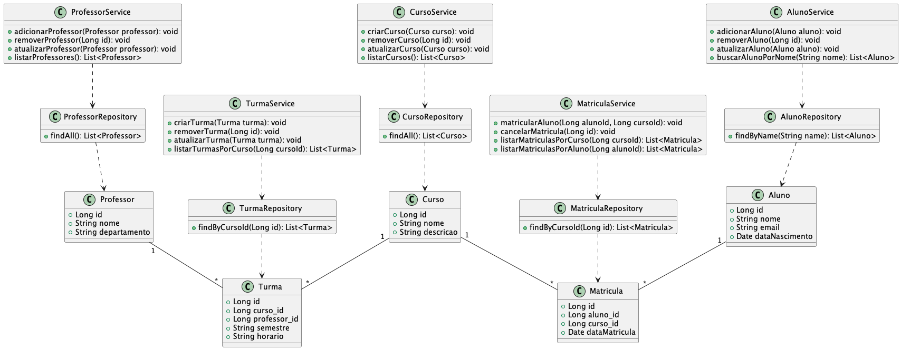

# Sistema de Gerenciamento de Alunos

Este é um sistema de gerenciamento de alunos desenvolvido em Java com Spring Boot e PostgreSQL.

### UML




## Instruções de uso Docker

O arquivo `docker-compose.yml` contém a configuração para o container do PostgreSQL. O arquivo está localizado na raiz do projeto.

#### Subindo apenas o container do PostgreSQL

Para subir apenas o container do PostgreSQL, você pode usar o comando `docker-compose up` com o nome do serviço que você deseja iniciar. No seu caso, o serviço é chamado de `postgres`. Portanto, o comando seria:

```bash
docker-compose up -d postgres_db
```

O `-d` é usado para iniciar o container em modo "detached", o que significa que ele será executado em segundo plano.

#### Verificando o status do container

Para verificar o status do seu container do PostgreSQL, você pode usar o comando `docker ps` com a opção `-a` para mostrar todos os containers (não apenas os que estão em execução). Para filtrar a saída para apenas o container do PostgreSQL, você pode usar o comando `grep`:

```bash
docker ps -a | grep postgres_db
```

#### Visualizando os logs do container

Para visualizar os logs do seu container do PostgreSQL, você pode usar o comando `docker logs`. Você precisará do nome do seu container, que neste caso é `postgres_db`:

```bash
docker logs postgres_db
```

#### Parando o container

Para parar o seu container do PostgreSQL, você pode usar o comando `docker stop` com o nome do seu container:

```bash
docker stop postgres_db
```

#### Deletando o container

Após parar o seu container, você pode removê-lo usando o comando `docker rm`. Novamente, você precisará do nome do seu container:

```bash
docker rm postgres_db
```

Lembre-se de que remover um container irá apagar todos os dados nele, a menos que esses dados estejam sendo armazenados em um volume. Neste caso, os dados do PostgreSQL em um volume chamado `postgres_data`, então esses dados não serão perdidos quando o container for removido.